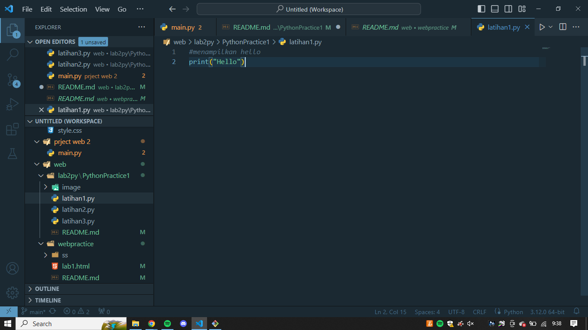
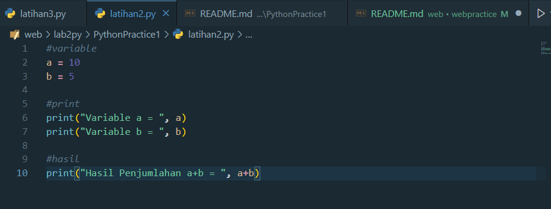
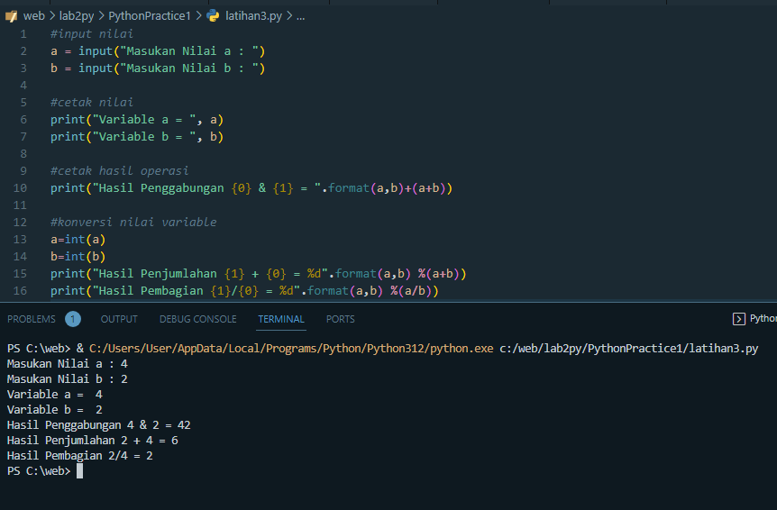

# PythonPractice1

## Practice Report

* Latihan 1

 
Memunculkan kata "Hello" di layar

    print("Hello")  

* Latihan 2

    # variable
    a = 10
    b = 5

    # print
    print("Variable a = ", a)
    print("Variable b = ", b)
    
    # hasil
    print("Hasil Penjumlahan a+b = ", a + b)

***a = 10*** dan ***b = 5*** merupakan sebuah variable dan intenger.
***, a + b*** merupakan perintah pada Python untuk menjumlahkan variabel yang tertera.

* Latihan 3

    #input nilai
    a = input("Masukan Nilai a : ")
    b = input("Masukan Nilai b : ")

    #cetak nilai
    print("Variable a = ", a)
    print("Variable b = ", b)

    #cetak hasil operasi
    print("Hasil Penggabungan {0} & {1} = ".format(a,b)+(a+b))

    #konversi nilai variable
    a=int(a)
    b=int(b)
    print("Hasil Penjumlahan {1} + {0} = %d".format(a,b) %(a+b))
    print("Hasil Pembagian {1}/{0} = %d".format(a,b) %(a/b))

***int*** berfungsi untuk mendefinisikan sifat perintah menjadi bilangan bulat.
***input*** berfungsi untuk memasukan kata atau bilangan yang diinginkan.
***, n*** dan ***, t*** berfungsi untuk meletakan variabel yang sudah didefinisikan sebelumnya.
***{0}*** dan ***{1}*** berfungsi untuk memanggil variabel sesuai urutan.
***%d*** merupakan hasil dengan definisi sesuai pada ***.format***.